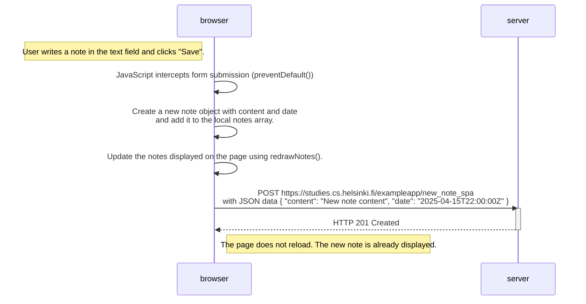

```mermaid
sequenceDiagram
    participant browser
    participant server

    Note left of browser: User writes a note in the text field and clicks "Save".

    browser->>browser: JavaScript intercepts form submission (preventDefault())

    browser->>browser: Create a new note object with content and date<br>and add it to the local notes array.

    browser->>browser: Update the notes displayed on the page using redrawNotes().

    browser->>server: POST https://studies.cs.helsinki.fi/exampleapp/new_note_spa<br>with JSON data { "content": "New note content", "date": "2025-04-15T22:00:00Z" }
    activate server
    server-->>browser: HTTP 201 Created
    deactivate server

    Note right of browser: The page does not reload. The new note is already displayed.
```
